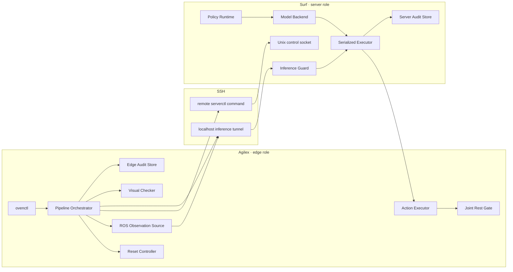

# 系统架构

状态：目标架构 + Stage 1/2 与 Stage 3 首批实现。未在“当前实现”中列出的组件仍是设计，不得误认为已完成。

运行平台固定为 Agilex Linux 与 Surf Linux。实现可以直接使用 Unix domain socket、POSIX signal、
`fcntl`、systemd 和 OpenSSH，不设计或维护 Windows 运行兼容性。

## 1. 目标与边界

系统完成三个左臂 Skill 的串联：

```text
open_door → transport_food → close_door
```

每个 Skill 都必须完成：

```text
preflight
→ physical reset（按 profile 决定）
→ policy prepare
→ observe-only warm-up
→ PRNG reset
→ rollout
→ joint rest gate
→ visual checker
→ audited handoff
```

首版不包含 Rotate Button。右臂只参与经过配置审核的复位或保持动作，不执行 policy rollout。

### 1.1 非目标

- 不兼容旧 inference 请求格式。
- 不运行旧 Shell wrapper、旧 orchestrator 或旧 Checker 入口。
- 不在一个 GPU 上同时保留多个完整 policy 参数树。
- 不自动重试含糊的 inference 请求。
- 不自动开始真实机器人测试。
- 不把“客户端退出码为 0”视为完整成功证据。

## 2. 部署拓扑

同一仓库在两台机器分别运行不同角色：



Surf 的控制接口使用权限为 `0600` 的 Unix socket。推理 WebSocket 只监听 `127.0.0.1`，
Agilex 通过 SSH local forwarding 访问。不存在面向局域网开放的控制端口。

## 3. 代码组件

### 3.1 `common`

两端共享、不依赖 ROS/JAX 的纯 Python 模块：

- `protocol.py`：请求、响应和错误的显式类型。
- `state.py`：服务端与流水线状态枚举及合法转换。
- `config.py`：TOML 加载、环境变量展开和 schema 校验。
- `audit_schema.py`：manifest、stage evidence 和 request evidence 结构。
- `hashing.py`：包含 dtype、shape、路径和值的稳定哈希。
- `wire.py`：项目自有的 MessagePack/NumPy binary codec、64 MiB 上限和不安全 dtype 拒绝。

`common` 必须可以在普通 CPU Python 环境运行测试。

### 3.2 `edge`

当前已实现：

- `control_client.py`：固定 `oven-serverctl --stdin-json` 远程命令，数据只走 JSON stdin，不拼接远端 shell 参数。
- `inference_client.py`：只连接本机 SSH tunnel endpoint；逐字段和逐哈希验证 response；不自动重试。
- `orchestrator.py`：固定三 Skill 状态推进、人工批准、warm-up/reset/rollout/gate/checker/handoff。
- `ros2_observation.py`：只订阅 Agilex joint/camera topic，不创建 publisher；提供只读现场采样。
- `ros2_action.py`：唯一 action publisher、右臂保持、左臂复位和有界发布。
- `joint_gate.py`：在线 departure→stable-return gate 与阶段末结构化 gate。
- `checker.py`：相对资产路径、SHA256 和安全 checkpoint 加载。
- `audit.py`：Edge run/stage/rollout 结构化证据。
- `app.py` / `tunnel.py`：真实 Edge 组合入口和 loopback SSH inference tunnel。

以下仍为目标组件：

- recording-only executor。
- 真机 `doctor`、外部急停状态输入和 systemd 部署。

只有 `ros2_action.py` 可以创建机器人动作 publisher。Observation、Checker、warm-up 和
审计模块不得创建任何动作 publisher。

### 3.3 `server`

当前已实现：

- `app.py`：组合 fake backend，并绑定 loopback WebSocket 与 Unix control socket。
- `control_server.py` / `control_protocol.py`：`0600` socket、`fcntl.flock` 单实例和严格命令 schema。
- `control_cli.py`：受限参数 CLI 及 SSH JSON-stdin 模式。
- `inference_server.py`：binary-only WebSocket 与 loopback bind 自检。
- `runtime.py`：policy/generation/session/trial 状态与完整 inference 互斥临界区。
- `backend.py` / `fake_backend.py`：后端协议和确定性测试后端。
- `audit.py`：trial 证据、首个正式 action chunk 与含糊回包终止状态。

以下仍为目标组件：

- `composite_adapter_backend.py`：共享 base + 单 Skill adapter。
- `full_checkpoint_backend.py`：完整 checkpoint 基线与回退后端。

## 4. 状态模型

### 4.1 Surf 模型状态

```text
STARTING
  → LOADING
  → WARMUP_REQUIRED
  → PRNG_RESET_REQUIRED
  → READY

READY
  → DRAINING
  → SWITCHING
  → LOADING

任意受控状态 → STOPPING
任意不可恢复错误 → FAILED
```

只有 `WARMUP_REQUIRED` 接受 `request_kind=warmup`。
只有 `READY` 且存在有效 session lease 时接受 `request_kind=infer`。

### 4.2 Session lease 状态

Session 状态与模型状态分离：

```text
NONE → ACTIVE → CLOSED
             ↘ EXPIRED
             ↘ ABORTED
```

同一时刻最多一个 ACTIVE session。Skill 切换、generation 改变、超时、连接歧义或 abort
都会使 session 失效。

### 4.3 Agilex 流水线状态

```text
CREATED
→ PREFLIGHT
→ RESETTING
→ PREPARING_POLICY
→ WARMING_UP
→ READY_TO_ROLLOUT
→ ROLLOUT
→ JOINT_GATE
→ CHECKING
→ HANDOFF
→ COMPLETED
```

任何阶段失败都进入 `SAFE_STOP`，随后进入 `FAILED`。`SAFE_STOP` 必须先停止动作 publisher，
再关闭 session，最后写入失败证据。不能用普通异常返回替代安全停止。

## 5. Skill 执行序列

单个 Skill 的正常序列：

1. Edge 验证 observation freshness、ROS topic、磁盘空间和动作 publisher 唯一性。
2. Edge 根据 profile 判断是否需要物理复位；复位后重新采样并验证关节状态。
3. Edge 通过 SSH 调用 Surf `prepare-skill`。
4. Surf 关闭旧 session、drain 当前 inference、加载目标后端并递增 generation。
5. Edge 请求新 session，取得 `session_id`、一次性 secret、skill 和 generation。
6. Edge 发送一次 `warmup` 请求；warm-up action 永不传入动作执行器。
7. Edge 通过 control 命令要求 Surf 将 PRNG 重置到本阶段 root seed。
8. Surf 进入 READY；Edge 在人工确认仍有效后进入 rollout。
9. 每个 inference 请求严格串行，response 必须回显相同 session、skill、generation 和 sequence。
10. Action Executor 校验 shape、有限值、关节范围、最大步进和时间戳后才能发布。
11. rollout 只能由明确的批准原因结束，例如 `joint_rest_detected` 或配置允许的 max-step。
12. Joint Gate 和 Checker 都通过后，Edge 关闭 session 并提交阶段证据。
13. 下一个 Skill 只能读取已经提交的上一个阶段证据，不能根据日志文本猜测结果。

## 6. 模型后端

统一接口：

```python
class ModelBackend(Protocol):
    def prepare(self, skill: SkillSpec) -> PreparedPolicy: ...
    def infer(self, observation: Observation, noise: Array) -> ActionChunk: ...
    def close(self) -> None: ...
```

### 6.1 Composite Adapter

默认实验后端。进程持有共享训练 base，Skill 切换时加载并合并相应 adapter。共享 base、adapter、
归一化资产和训练配置都必须记录 SHA256 或稳定版本标识。

### 6.2 Full Checkpoint

用于基线比较和 adapter 回退。它与 Composite Adapter 使用同一协议和审计格式，因此比较不需要
另一套 orchestrator。

后端不得自行管理 session、ROS 或动作发布。

## 7. 路径与配置

仓库内路径全部相对项目根目录。机器相关路径只允许出现在未提交的 site 配置或环境变量中：

```text
OVEN_CHECKPOINT_ROOT
OVEN_ASSET_ROOT
OVEN_RUNTIME_ROOT
OVEN_OPENPI_ROOT
```

示例 Skill 配置只保存相对标识：

```toml
name = "open_door"
checkpoint = "pi05_od_201ep_lf7_b8_s40k_0717/train/39999"
checker_model = "checkers/open_door/model_best.pth"
```

解析后必须验证目标位于对应根目录之下，禁止 `..` 逃逸和任意绝对路径注入。

## 8. 资产独立性

旧目录中的 Checker 权重和校准数据只允许经过一次性迁移进入新的 `OVEN_ASSET_ROOT`。迁移过程：

1. 只读复制；
2. 生成 `assets.lock.json`；
3. 记录源说明、文件大小和 SHA256；
4. 新运行时只读取新资产目录；
5. 旧目录随后不可用时，新项目仍能运行。

checkpoint 保持在正式数据根目录，不复制进 Git。

## 9. 失败与取消

所有外部操作必须有配置上限：

- SSH 连接和命令 timeout；
- 模型加载 timeout；
- observation freshness timeout；
- inference timeout；
- reset timeout；
- rollout 总时限和 max-step；
- Checker timeout；
- drain timeout；
- monitor shutdown timeout。

Inference 请求一旦发送但没有收到确认，属于“结果不明”。客户端不得自动重发；必须 abort 当前
session，将 trial 标为 ambiguous，并由操作员决定是否物理复位后重开 trial。

## 10. 运行证据

每个 run 生成独立目录：

```text
runtime/runs/<run_id>/
├── manifest.json
├── config_snapshot.toml
├── assets_snapshot.json
├── joint_trace.jsonl
└── stages/
    └── <index>_<skill>/
        ├── stage_evidence.json
        ├── server_evidence.json
        ├── rollout.jsonl
        ├── joint_gate.json
        └── checker.json
```

阶段完成条件由结构化字段计算，不解析自由文本日志。日志只用于诊断。

## 11. 目标源码结构

```text
src/oven_runtime/
├── common/
├── edge/
└── server/
tests/
├── unit/
├── protocol/
├── integration/
├── fault_injection/
└── fake_robot/
```

模块导入不得依赖运行目录、`sys.path` 注入或 monkey patch。

## 12. 进入真实模型/机器人前仍需确认的决定

1. 首个真机后端默认使用 Composite Adapter；Full Checkpoint 只做对照和回退。
2. 三技能全流程默认只在 run 开始前执行一次双臂物理复位；阶段间依赖 Joint Gate 交接。
3. Checker 权重迁移到 Agilex 独立资产根目录，不放入 Git。
4. Surf 推理仅通过 SSH tunnel 暴露，不开放局域网端口。

其中第 4 项已经由当前传输实现和测试固定。其余决定在接入真实 OpenPI backend、Checker 和物理复位前
仍需要人工审查，不能由实现代码替用户决定。
